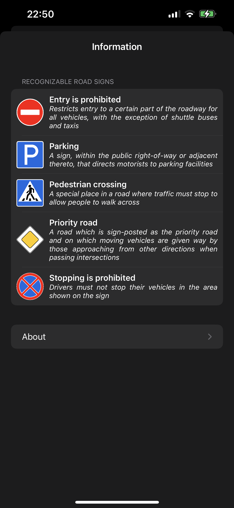

# RoadSignDetection
### Contents
- [Description](#description)
- [Features](#features)
- [Interface](#interface)
- [Detailed information](#detailed-information)
   - [Goal of the work](#goal-of-the-work)
   - [Initial data](#initial-data)
   - [Data collection](#data-collection)
   - [Data preparation](#data-preparation)
   - [Model Training](#model-training)
   - [iOS App](#ios-app)

## Description
## Features
## Interface

    
    
    

## Detailed information
- ### Goal of the work
  The purpose of this work is to create an ML model and develop an iOS application for search and recognition of road signs by photo.
- ### Initial data
  The data for training the model was collected manually using search results and own photos taken outside in different weather conditions and under different lighting conditions.
- ### Data collection
  When collecting data for image classification, I was guided by the following recommendations from Apple:
  - Use at least 10 images per category — the more, the better.
  - Avoid highly unbalanced data sets by preparing approximately an equal number of images for each category.
  - Make your model more reliable by enabling Create ML UI's parameters.
  - Do not disdain redundancy for your training sets: shoot a lot of images from different angles, with different backgrounds and in different conditions lighting.
  - Take pictures of sample objects in your hands to simulate real users who are trying to classify objects in their hands.
  - Exclude other objects from view, especially those that you want to classify differently
- ### Data preparation
  Data preparation was carried out using the IBM Cloud Annotations service. In this service, objects were marked on each image. The labeling was to highlight and sign a road sign on each data image. The result of data preparation using IBM Cloud Annotations is a JSON file containing coordinate data and the name of each marked object in the photo.
- ### Model Training
  The model was trained in the Apple Create ML program, which took a JSON file with a database of all images as input and output a model file of the form .mlmodel, which was imported into the iOS app. The advantages of this approach can be noted: running the model locally on the user's device eliminates the need for a network connection, which helps to maintain the confidentiality of user data and improves the response of the application. However, it is worth mentioning the disadvantages: the model file has a rather large size, which negatively affects the size of the entire application.
- ### iOS App
  The developed application runs under the control of the UIKit framework. When writing the program, both libraries and resources provided by the Swift language, as well as the tools of the UIKit, CoreML, Vision frameworks.
